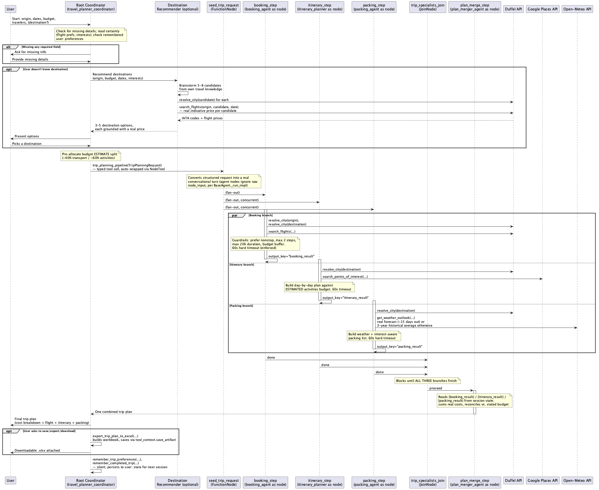

# Travel Planner Agent — Sequence Diagram



## Diagram Source

```mermaid
sequenceDiagram
    participant User
    participant Root as Root Coordinator<br/>(travel_planner_coordinator)
    participant Dest as Destination Recommender<br/>(optional, AgentTool)
    participant Seed as seed_trip_request<br/>(FunctionNode)
    participant Booking as booking_step<br/>(booking_agent as node)
    participant Itinerary as itinerary_step<br/>(itinerary_planner as node)
    participant Packing as packing_step<br/>(packing_agent as node)
    participant Join as trip_specialists_join<br/>(JoinNode)
    participant Merger as plan_merge_step<br/>(plan_merger_agent as node)
    participant Duffel as Duffel API
    participant Places as Google Places API
    participant Weather as Open-Meteo API

    User->>Root: Start: origin, dates, budget, travelers, (destination?)
    Note over Root: Check for missing details;<br/>read certainty (flight prefs, interests);<br/>check remembered user: preferences

    alt Missing any required field
        Root->>User: Ask for missing info
        User->>Root: Provide missing details
    end

    opt User doesn't know destination
        Root->>Dest: Recommend destinations<br/>(origin, budget, dates, interests)
        Dest->>Dest: Brainstorm 5-8 candidates<br/>from own travel knowledge
        Dest->>Duffel: resolve_city(candidate) for each
        Dest->>Duffel: search_flights(origin, candidate, date)<br/>— real indicative price per candidate
        Duffel-->>Dest: IATA codes + flight prices
        Dest-->>Root: 3-5 destination options,<br/>each grounded with a real price
        Root->>User: Present options
        User->>Root: Picks a destination
    end

    Note over Root: Pre-allocate budget ESTIMATE split<br/>(~40% transport / ~60% activities)

    Root->>Seed: trip_planning_pipeline(TripPlanningRequest)<br/>— a typed tool call, auto-wrapped via NodeTool
    Note over Seed: Converts the structured request into<br/>a real conversational turn (agent nodes<br/>ignore raw node_input, per BaseAgent._run_impl)

    Seed->>Booking: (fan-out)
    Seed->>Itinerary: (fan-out, concurrent)
    Seed->>Packing: (fan-out, concurrent)

    par Booking branch
        activate Booking
        Booking->>Duffel: resolve_city(origin), resolve_city(destination)
        Booking->>Duffel: search_flights(...)
        Note over Booking: Apply guardrails: prefer nonstop,<br/>max 2 stops, max 20h duration, budget buffer.<br/>60s hard timeout (framework-enforced)
        Booking->>Booking: output_key="booking_result"
        deactivate Booking
    else Itinerary branch
        activate Itinerary
        Itinerary->>Duffel: resolve_city(destination)
        Itinerary->>Places: search_points_of_interest(...)
        Note over Itinerary: Build day-by-day plan against<br/>ESTIMATED activities budget.<br/>60s hard timeout
        Itinerary->>Itinerary: output_key="itinerary_result"
        deactivate Itinerary
    else Packing branch
        activate Packing
        Packing->>Duffel: resolve_city(destination)
        Packing->>Weather: get_weather_outlook(...)<br/>real forecast (~15 days out) or<br/>3-year historical average otherwise
        Note over Packing: Build weather + interest-aware<br/>packing list. 60s hard timeout
        Packing->>Packing: output_key="packing_result"
        deactivate Packing
    end

    Booking->>Join: done
    Itinerary->>Join: done
    Packing->>Join: done
    Note over Join: Blocks until ALL THREE branches finish

    Join->>Merger: proceed
    activate Merger
    Note over Merger: Reads {booking_result} / {itinerary_result} /<br/>{packing_result} from session state;<br/>sums real costs, reconciles vs. stated budget
    Merger-->>Root: One combined trip plan
    deactivate Merger

    Root->>User: Final trip plan<br/>(cost breakdown + flight + itinerary + packing)

    opt User asks to save/export/download
        Root->>Root: export_trip_plan_to_excel(...)<br/>builds workbook, saves via tool_context.save_artifact
        Root->>User: Downloadable .xlsx attached
    end

    Root->>Root: remember_trip_preferences(...),<br/>remember_completed_trip(...)<br/>— silent, persists to user: state for next session
```

## Data Flow Summary

| Stage | Input | Processing | Output |
|-------|-------|-----------|--------|
| **Gathering** | User conversation | Coordinator asks for: origin, destination (or "recommend one"), dates, budget, travelers, interests, travel class; reads certainty per decision point and remembered `user:` preferences from past sessions | Trip requirements confirmed |
| **Destination (optional)** | Origin, budget, dates, interests | `destination_recommender_agent`: brainstorm candidates → `resolve_city` → `search_flights` for a real price per candidate | 3-5 destination options, user picks one |
| **Budget split (upfront estimate)** | Total budget | Coordinator pre-allocates ~40% transport / ~60% activities *before* any specialist runs | `TripPlanningRequest` with both estimates |
| **Seed** | `TripPlanningRequest` | `seed_trip_request` (FunctionNode) converts the structured request into a real conversational turn | A session turn all three branches can read |
| **Booking + Itinerary + Packing (parallel)** | That turn | `Workflow`'s graph runs `booking_step`/`itinerary_step`/`packing_step` concurrently — none see each other's output | `booking_result`, `itinerary_result`, `packing_result` (session state via `output_key`) |
| **Join** | All three branches' completion | `trip_specialists_join` (`JoinNode`) blocks until all three finish | Synchronization only — the actual data travels via session state, not through the join |
| **Merge & reconcile** | All three results, user's real total budget | `plan_merge_step`: sum actual costs, compare vs. real budget, flag over/under, combine itinerary + packing | One final trip plan with accurate cost breakdown |
| **Export (optional)** | Final plan details, user request | `export_trip_plan_to_excel`: builds a 3-sheet workbook, saves via ADK's artifact system | Downloadable `.xlsx` attached in the chat UI |
| **Remember (silent)** | Final plan details | `remember_trip_preferences` / `remember_completed_trip`: write to `user:`-prefixed session state | Durable facts available in the user's *next* conversation |

## Key Design Decisions

- **ADK's graph/node `Workflow` engine, not the deprecated workflow-agent classes**: `google.adk.workflow` (`Workflow`, `JoinNode`, `node()`) is what ADK 2.x's own docs point to as the successor to `ParallelAgent`/`SequentialAgent`. The project started on the latter, then migrated once the graph engine's actual data-flow mechanics were verified against the installed SDK source — see `PROGRESS.md` for the full trail (auto-`NodeTool` wrapping, agent cloning, the `seed_trip_request` fix).
- **No explicit tool wrapper needed**: `trip_planning_pipeline` (a `Workflow`) sits directly in the coordinator's `tools=[...]` list. ADK's own tool-resolution code auto-wraps any non-agent `BaseNode` via `NodeTool` — confirmed by calling `canonical_tools()` directly and getting back a real `NodeTool` we never constructed.
- **Typed tool call, not a text blob**: because the `Workflow` declares `input_schema=TripPlanningRequest`, the coordinator calls it with 13 typed, named parameters (dates, budgets, certainty levels, etc.) instead of one freeform message — a real reliability upgrade over the earlier design.
- **Three-way parallel, not two**: `booking_agent`, `itinerary_planner_agent`, and `packing_agent` don't depend on each other's tool calls at all — booking/itinerary only share how the budget is split, and packing doesn't touch budget. Adding `packing_step` as a third fan-out branch (rather than sequencing it after the others) needed no change to the fan-out/join *pattern*, only its width — a good sign the graph shape was the right one to begin with.
- **Reconciliation, not sequencing, fixes the budget dependency**: `plan_merge_step` sums booking/itinerary's *actual* costs and compares against the *real* total budget after both finish — so a flight that came in pricier than the 40% estimate still gets caught. Packing has no budget to reconcile.
- **Real, framework-enforced timeouts**: each specialist node carries a native `timeout=60s`; the whole `Workflow` carries `timeout=180s`. A node that overruns is cancelled by ADK itself (`NodeTimeoutError`), not just discouraged by a prompt.
- **Forecast vs. estimate, always labeled**: `packing_agent` uses a real Open-Meteo forecast when the trip is within ~15 days, otherwise a 3-year historical average for the same calendar dates — the distinction is carried through to the user rather than presented as a single "the weather will be X."
- **Certainty-aware options** apply per specialist, independently: booking might auto-select one flight while itinerary returns two themed variants (or vice versa) — the coordinator presents whatever came back rather than forcing a single path.
- **Real data grounding, three providers, no API key for two of them**: flights and destination validation come from Duffel (test-mode sandbox); points of interest from Google Places; weather from Open-Meteo (free, no key). Originally all of this ran on Amadeus — see `PROGRESS.md` for why it moved (Amadeus fully shut down its self-service API on 2026-07-17). No airport-transfer search or historical price-quartile ("best time to book") feature survived that migration — dropped, not approximated, since neither Duffel nor Google Places has an equivalent.
- **Export and memory are both additive, not part of the parallel pipeline**: exporting to Excel and persisting `user:` state both happen at the *coordinator* level, after the merged plan already exists — they don't need graph parallelism since they're one-shot actions on already-finished data, not independent work that benefits from running concurrently.
